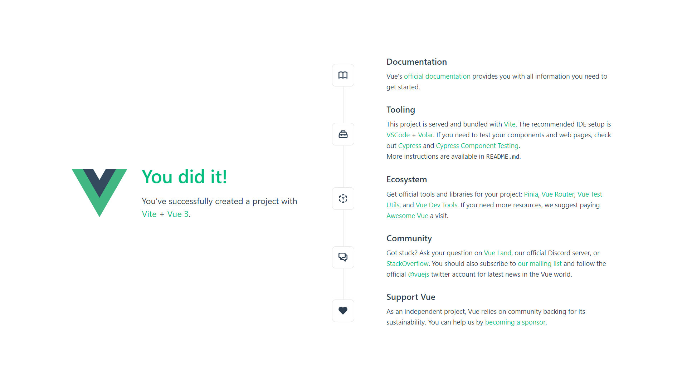

---

Author: Alain ORLUK / ID-Formation  
Formation : Développeur Web & Web mobile  
Lieu: Strasbourg
Date : 26/05/2022  

---
# **La librairie create-vue**

## **Première utilisation de la librairie create-vue**

Commencez par créer un dossier à l'emplacement que vous souhaitez.  

Ouvrez un terminal à l'emplacement du dossier et entrez la commande suivante :  

```bash
npm init vue@latest
```

Cette commande permet d'installer et d'exécuter la dernière version de create-vue qui permet de lancer la configuration d'une nouvelle application Vue.js.  

Lorsque vous entrez la commande pour la première fois vous aurez la demande de confirmation d'installer create-vue :  

```bash
Need to install the following packages:
  create-vue@3.3.4
Ok to proceed? (y)
```

Vous devrez simplement répondre `y` ou `yes`.  

Viennent ensuite toutes les questions sur la configuration de l'application.  

La première est le nom que vous souhaitez donner à votre application :  

```bash
Vue.js - The Progressive JavaScript Framework

Project name: › vue-project
```

Par défaut, le nom est prérempli avec vue-project mais vous pouvez bien sûr le changer.  

La deuxième question est sur l'utilisation de TypeScript :  

```bash
✔ Add TypeScript? … No / Yes
```

Comme nous l'avons vu, choisissez oui (avec la flèche directionnelle du clavier :D).  

Ensuite répondez `non` pour JSX.  

Nous n'utiliserons par JSX qui est un langage de template React.  

Répondez `non` pour Vue Router, Pinia, Vitest et Cypress car nous les verrons plus tard dans le cours.  

Répondez `oui` à ESLint, qui permet de contrôler la qualité du code et répondez `oui` à Prettier pour le formatage du code.  

Vous devez en être là :  

```bash
PS C:\Users\IDFORMATION\Documents\FORMATIONS\_DWWM\SUPPORTS DE COURS\CCP1\VUEJS> npm init vue@latest
Need to install the following packages:
  create-vue@3.3.4
Ok to proceed? (y) y

Vue.js - The Progressive JavaScript Framework

√ Project name: ... vue-project
√ Add TypeScript? ... Yes
√ Add JSX Support? ... No
√ Add Vue Router for Single Page Application development? ... No
√ Add Pinia for state management? ... No
√ Add Vitest for Unit Testing? ... No
√ Add Cypress for both Unit and End-to-End testing? ... No
√ Add ESLint for code quality? ... Yes
? Add Prettier for code formatting? » Yes

Scaffolding project in C:\Users\IDFORMATION\Documents\FORMATIONS\_DWWM\SUPPORTS DE COURS\CCP1\VUEJS\vue-project...

Done. Now run:

  cd vue-project
  npm install   
  npm run lint  
  npm run dev   

PS C:\Users\IDFORMATION\Documents\FORMATIONS\_DWWM\SUPPORTS DE COURS\CCP1\VUEJS>
```

## **Installation des dépendances**

Pour le moment, create-vue a déclaré toutes les dépendances et les configurations nécessaires en suivant vos options.  

Aucune dépendance JavaScript n'a encore été installée par `npm`.  

Pour les installer, il suffit d'ouvrir un terminal et d'aller dans le dossier de votre application, par exemple :  

```bash
cd vue-project
```

Et ensuite de lancer l'installation des dépendances :  

```bash
npm install
```

## **Utilisation du linter**

Un linter est un outil d'analyse de code qui permet de détecter les erreurs et les problèmes de syntaxe.  

La configuration du *linter*, en l'occurrence **ESLint** est dans le fichier `.eslintrc.cjs` :  

```js
/* eslint-env node */
require('@rushstack/eslint-patch/modern-module-resolution')

module.exports = {
    root: true,
    'extends': [
        'plugin:vue/vue3-essential',
        'eslint:recommended',
        '@vue/eslint-config-typescript',
        '@vue/eslint-config-prettier'
    ],
    parserOptions: {
        ecmaVersion: 'latest'
    }
}
```

`create-vue` a donc automatiquement créé la bonne configuration du linter pour une utilisation avec Vue.js.  

Pour exécuter le linter avec la configuration faites :  

```bash
npm run lint
```

Cela exécutera le script `lint` déclaré dans le fichier `package.json`.  

Pour l'instant il n'y a bien sûr aucune indication car nous n'avons pas commencé à coder !  

Mais exécuter cette commande de temps en temps lors du développement permet d'éviter certaines erreurs et de suivre les recommandations pour les bonnes pratiques en matière de syntaxe (appelées *coding style*).  

## **Lancer le serveur de développement**

Pour lancer le serveur de développement il suffit d'exécuter le **script** `dev` :  

```bash
npm run dev
```

Cela va en fait exécuter **vite** qui va lancer son serveur de développement.  

Vous pourrez ainsi accéder à l'application Vue.js dans votre navigateur à l'adresse <http://localhost:3000/>.  
Le port peut être différent si vous avez un autre serveur qui l'utilise déjà.  

Par exemple, chez moi cela donne :  

```bash
> vue-project@0.0.0 dev
> vite


  VITE v3.1.4  ready in 734 ms

  ➜  Local:   http://127.0.0.1:5173/
  ➜  Network: use --host to expose
```

Et en ouvrant le lien dans mon navigateur :  

