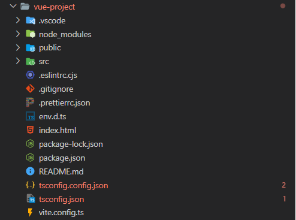

---

Author: Alain ORLUK / ID-Formation  
Formation : Développeur Web & Web mobile  
Lieu: Strasbourg
Date : 26/05/2022  

---
# **Architecture initiale**

## **Architecture initiale d'un projet généré par create-vue**

L'architecture initiale du projet généré est la suivante :  


## **Détail des fichiers et des dossiers**

- **`vite.config.js`** : fichier de configuration de **Vite**.  

- **`tsconfig.vite-config.json`** : fichier de configuration de **Vite** pour pouvoir utiliser **TypeScript**.  
  Vous pouvez retirer **vitest** et **cypress** de la propriété `include` car nous ne l'utiliserons pas pour le moment :  

  ```json
  {
    "extends": "@vue/tsconfig/tsconfig.node.json",
    "include": ["vite.config.*"],
    "compilerOptions": {
        "composite": true,
        "types": ["node"]
    }
  }
  ```

- **`tsconfig.json`** : fichier de configuration de **TypeScript**. Toutes les applications utilisant **TypeScript** ont ce fichier. Il permet de configurer notamment les options pour transpiler le **TypeScript** en **JavaScript**.  

- **`README.md`** : décrit brièvement les différentes commandes possibles et la configuration recommandée de l'éditeur VS Code.

- **`package.json`** et **`package-lock.json`** : ces fichiers **JSON** permettent de décrire le projet et surtout de détailler les dépendances et leurs versions requises pour l'utiliser.  
Il décrit également les scripts pouvant être lancés avec `npm run`.  
Les scripts disponibles sont :  

  - `dev` : qui permet de lancer le serveur de développement de Vite en local.  

  - `build` : qui permet de construire la version de l'application optimisée pour la production.  

  - `preview` : qui permet de visualiser la version de production en local (par exemple avant de la mettre réellement en production sur des serveurs).  

  - `typecheck` : qui permet de vérifier les types du code **TypeScript** sans transpiler le TypeScript en JavaScript.  

  - `lint` : qui permet d'exécuter **ESLint** avec les bonnes options.  

- **`index.html`** : **template** HTML qui sera envoyé au navigateur.  

- **`env.d.ts`** : fichier qui permet de charger des types supplémentaires pour utiliser **TypeScript** avec **Vue.js**.  

- **`gitignore`** : permet de lister les fichiers qui ne doivent pas être pris en compte par **Git**.  

- **`.eslintrc`** : fichier de configuration de **ESLint** que nous avons déjà expliqué.  

- **`src`** : dossier qui contient les fichiers sources de votre application (d'où le nom **src** pour source).  

- **`public`** : dossier qui contient les fichiers qui n'ont pas besoin d'être traité par **Vite** ou par aucun outil et qui sont directement envoyés par le serveur au navigateur.  

- **`src/main.ts`** : il s'agit du point d'entrée de notre application.  
Nous expliquerons plus loin dans le cours la fonction `createApp()` ainsi que `$mount`.  
Sachez simplement que nous importons notre composant racine **App** et créons l'instance racine de l'application ici.  

- **`src/App.vue`** : il s'agit du composant référencé dans `main.ts` qui constitue la racine des *vues* de notre application.  
Il s'agit du **premier composant rendu** et de lui découle les rendus de tous les autres composants.  
Nous étudierons la structure des composants dans une prochaine leçon.  

- **`src/components`** : dossier qui contient les composants de notre application Vue.

- **`src/components/HelloWorld.vue`** : sous-composant de `App.vue`.

- **`src/assets`** : dossier contenant les ressources de l'application comme les *images*, le *CSS* etc.

- **`node_modules`** : contient toutes les dépendances installées par **npm**.
