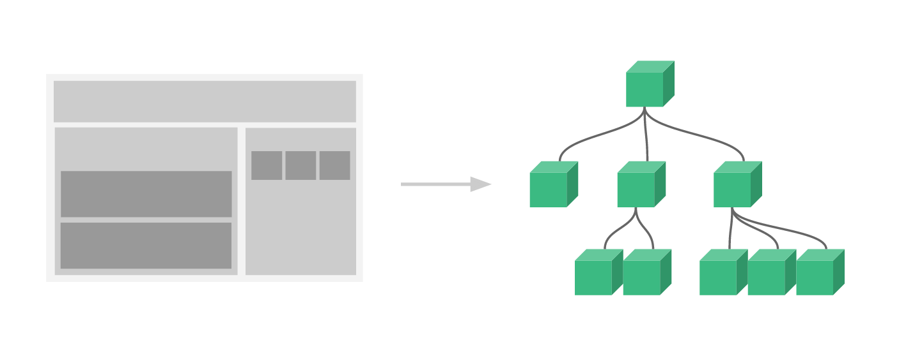
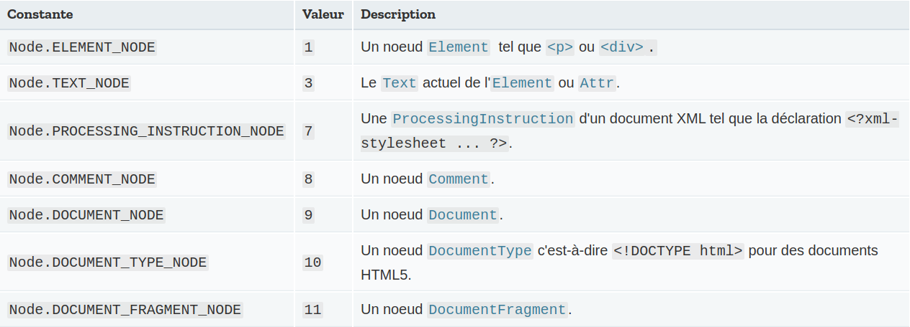

# **Comment fonctionne Vue ?**

Nous allons voir les fichiers par ordre logique.  
Le navigateur reçoit en premier l'`index.html`.

## **Le fichier `index.html`**

Le fichier `index.html` est ce que le navigateur va lire en premier :

```html
<!DOCTYPE html>
<html lang="fr">
  <head>
    <meta charset="UTF-8" />
    <link rel="icon" href="/favicon.ico" />
    <meta name="viewport" content="width=device-width, initial-scale=1.0" />
    <title>Vite App</title>
  </head>
  <body>
    <div id="app"></div>
    <script type="module" src="/src/main.ts"></script>
  </body>
</html>
```

Notez bien qu'il y a une **div** conteneur avec l'id `app`.

Notez également que le fichier `src/main.ts` est chargé comme un **module JavaScript**.  
Le navigateur demande donc ce module au serveur.

## **Le fichier `src/main.ts`**

Le fichier main.ts est le point d'entrée de l'application car c'est le premier fichier **JavaScript** chargé par le navigateur.

Note : le fichier est en `.ts` car c'est un fichier **TypeScript** mais il sera transpilé par **Vite** en JavaScript que ce soit pour le développement ou la production.  
En effet, le navigateur ne comprend que le langage JavaScript et pas le TypeScript.

```ts
import { createApp } from "vue";
import App from "./App.vue";

import "@/assets/img/main.css";

createApp(App).mount("#app");
```

`import App from "./App.vue";` permet d'importer le composant **App** que nous verrons juste après.

`createApp()` permet de créer une _instance_ de votre application Vue.js.

Elle prend en argument, le composant racine, c'est-à-dire le premier composant de votre application qui aura d'autres composants enfants.

`mount()` permet de monter l'application instanciée par `createApp()` dans un conteneur qui est identifié par un sélecteur CSS.  
Ici, cela signifie que le composant racine `App` sera monté sur le conteneur dont l'**id** est `app` :

```html
<div id="app"></div>
```

Le composant sera ainsi affiché (on dit plus souvent _rendu_) dans ce conteneur.

## **Le fichier `src/App.vue`**

Le fichier `App.vue` est le **composant racine**.  
C'est le premier composant de l'application qui est chargé et instancié par `createApp()`.

Ce composant est le sommet de ce qu'on appelle **l'arbre des composants** : à savoir l'organisation hiérarchique des composants de l'application.

Une application a des dizaines voir des centaines de composants qui sont organisés en arbre à partir du composant racine :



Remarquez déjà que le composant `App.vue` est constitué de trois parties : `template`, `script` et `style`.

Nous étudierons bientôt les composants en détail.

## **Aller plus loin sur le fonctionnement de Vue.js : le DOM virtuel**

Nous allons d'abord effectuer quelques rappels avant d'approfondir le fonctionnement de Vue.js.

### **Le DOM (`Document Object Model`)**

Le **DOM** permet de passer du HTML à un grand objet `document` qui est un _arbre_ regroupant tous les éléments déclarés en HTML.

Autrement dit, lorsque le navigateur reçoit le HTML de la page, il va le parser (c'est-à-dire l'analyser) et le transformer en **DOM** grâce à des algorithmes.

Ainsi, les attributs HTML deviennent automatiquement des propriétés des objets du DOM.

Par exemple :

```html
<body id="page"></body>
```

Devient un **noeuds** sur l'objet `document` qui sera un objet `body` contenant une propriété `id` contenant la valeur `page`.

Il existe plusieurs types de noeuds :



### **Le DOM virtuel**

Dans les applications Web modernes, il peut y avoir des centaines ou des milliers de nœuds sur lesquels sont enregistrés de nombreux gestionnaires d'événements.

En conséquence, de très nombreuses mises à jour du DOM doivent être réalisées.

Or, ces mises à jour sont très coûteuses en performance car plus le DOM est grand, plus les recherches et les changements sont coûteux.

Vue.js utilise donc un DOM virtuel (appelé VDOM) qui est une représentation du DOM en JavaScript.

Le DOM virtuel n'est donc qu'un simple, **_immense_**, objet **JavaScript** :

```js
const vnode = {
  type: "div",
  props: {
    id: "hello",
  },
  children: [
    /* plein de vnodes */
  ],
};
```

Les noeuds du DOM virtuels sont appelés des noeuds virtuels ou vnode (pour virtual node).

Vue.js va transformer le VDOM en DOM pour que le navigateur puisse afficher la page.  
Ce processus est appelé le **montage** (**mount** en anglais).

Lorsque des mises à jour sur la page doivent intervenir, le DOM virtuel est modifié avant que les modifications sur le DOM ne soient effectuées.

Le DOM virtuel est une représentation légère du DOM en JavaScript qui peut être utilisée par des algorithmes très performants de comparaison des différences entre DOM virtuel et DOM.

Dès lors que le DOM doit être modifié, un patch est appliqué par **Vue.js** de manière extrêmement optimisée pour ne réaliser que les changements absolument nécessaires.

Par exemple, si aucune valeur affichée ne change, alors aucune mise à jour du DOM n'est déclenchée ce qui économise beaucoup en performance.

En résumé, **Vue.js** va créer au départ un DOM virtuel puis le convertir en DOM HTML pour l'affichage lors du montage.

Lorsque des changements interviennent, par exemple un événement survient, les changements affectant le DOM virtuel sont analysés par des algorithmes et seuls les changements ayant un effet sur l'affichage sont propagés au DOM lors de la phase de mise à jour (**patch** ou **diffing** en anglais).

Ainsi, seules les insertions, les modifications et les suppressions d'éléments HTML absolument nécessaires sont effectuées, ce qui permet un énorme gain de performance.
