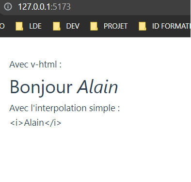

# **Directive v-html**

## **La directive `v-html`**

La directive `v-html` permet de mettre à jour l'attribut `innerHTML` d'un élément.  
Le contenu sera inséré comme du HTML simple.

Attention ! Le rendu dynamique de HTML sur votre site Web peut être très dangereux car il peut facilement conduire à des attaques XSS.

U**tilisez uniquement `v-html` sur un contenu sûr et jamais sur du contenu fourni par l'utilisateur**.

Voici un exemple :

```html
<template>
  <span>Avec v-html :</span>
  <h1>Bonjour <span v-html="name"></span></h1>
  <!-- Remarquez la différence avec v-text : -->
  <span>Avec l'interpolation simple :</span>
  <div>{{ name }}</div>
</template>
<script setup lang="ts">
  const name = "<i>Alain</i>";
</script>
<style></style>
```


