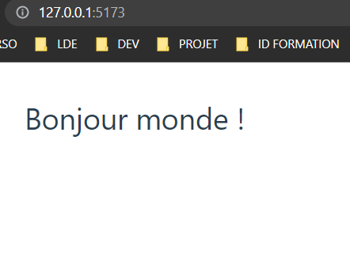

# **Liaison de propriété avec v-bind**

## **La directive `v-bind`**

La directive `v-bind` permet d'associer dynamiquement un attribut à une propriété.

### **Syntaxe de base**

Elle prend en argument l'attribut auquel la propriété est liée.

Ainsi par exemple :

```html
<a v-bind:href="url"></a>
```

L'attribut `href` de l'ancre est liée ici à la valeur de la variable `url` grâce à l'utilisation de la directive `v-bind`.

### **Syntaxe raccourcie**

Comme cette directive est extrêmement utilisée, il existe une forme raccourcie :

```html
<a :href="url"></a>
```

C'est cette forme que nous utiliserons dans le cours et qui est recommandée.

### **Utilisation sur des attributs booléens**

Les attributs booléens sont les attributs pour lesquels la simple présence de l'attribut représente la valeur
`true` et leur absence la valeur `false`.  
Il y en a 26 différents.

Des exemples sont : `disabled`, `checked`, `multiple`, `readonly`, `selected`, `hidden` etc.

Lorsque la directive `v-bind` est utilisée sur un attribut booléen, le comportement est le suivant : si la variable liée vaut `true` alors l'attribut sera ajouté par **Vue.js** automatiquement, si la variable vaut `false`
alors l'attribut sera retiré.

Par exemple :

```html
<button :disabled="isButtonDisabled">Button</button>
```

Si `isButtonDisabled` vaut `true` alors l'attribut `disabled` sera ajouté par **Vue.js** sur le DOM, s'il vaut `false` il sera enlevé.

### **Utilisation sur plusieurs attributs**

La directive `v-bind` peut être utilisée pour lier un objet contenant des paires **nom-valeur** d'attribut.  
Exemple :

```html
<div v-bind="{ id: propriété, 'autre-attribut': autrePropriété }"></div>
```

Ainsi, si nous avons côté script :

```ts
const objet = {
  id: "container",
  class: "container",
};
```

Nous pouvons lier cet objet avec la directive `v-bind` :

```html
<div v-bind="objet"></div>
```

Attention ! Dans ce cas la notation raccourcie n'est pas possible.

### **Utilisation avec class et style**

Lorsqu'elle est utilisée avec les attributs `class` ou `style`, la directive `v-bind` peut prendre un tableau ou un
objet en argument de cette façon :

```html
<div :style="{ fontSize: size + 'px' }"></div>
```

Ou :

```html
<div :class="[classA, classB]"></div>
```

Nous verrons des exemples dans le cours.

### **Utilisation avec un attribut dynamique**

Vous pouvez utiliser une liaison dynamique également sur l'attribut avec cette syntaxe :

```html
<button :[clé]="valeur"></button>
```

Ici l'attribut peut être modifié dynamiquement en modifiant la valeur de la variable clé.

Exemple :

```html
<template>
  <h1 :class="h1Title" :id="h1Id">Bonjour monde !</h1>
</template>

<script setup lang="ts">
  const h1Title = "une-classe";
  const h1Id = "un_id";
</script>

<style></style>
```


